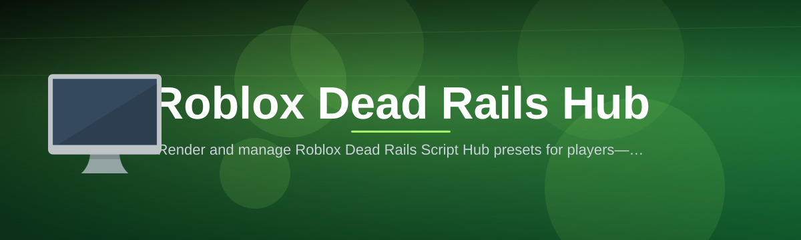

 

  
  
  

  

  
  
  
  

---

Render and manage Roblox Dead Rails Script Hub presets for players—one desktop companion, no subscription, no scattered tabs.

## Overview

Render and manage Roblox Dead Rails Script Hub presets for players—one desktop companion, no subscription, no scattered tabs.

  

## License

[MIT License](LICENSE)

  

